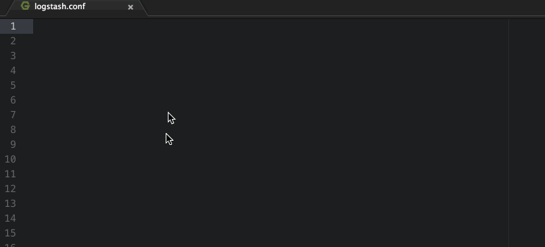

# Logstash config support in Atom

Adds syntax highlighting and snippets for writing logstash files in Atom.

Please raise issues for any new features or bugs.

Developed by [@imrichardcole](https://twitter.com/imrichardcole)
